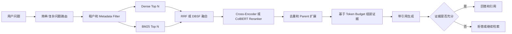
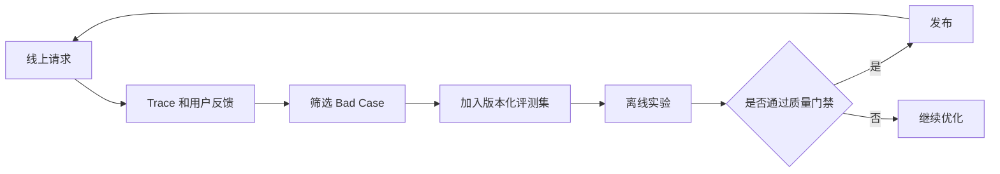

# 企业级 Agentic RAG 工程化改造计划

> 目标：将当前项目从功能完整的 Agentic RAG 教学原型，升级为具备量化评估、可靠检索、可信回答、生产服务能力和可复现工程证据的企业级 RAG 项目，并形成可用于校招简历和技术面试的核心项目。

## 1. 项目现状

当前项目已经具备较好的 RAG 架构基础：

- 基于 Qdrant 的 Dense + BM25 混合检索；
- Parent-Child 分层索引；
- 查询改写和模糊问题澄清；
- 多子问题并行处理；
- Agent 自纠错和上下文压缩；
- LangGraph 会话编排；
- Langfuse 链路追踪；
- 基于 RAGAS 的离线评测 notebook；
- Gradio、Ollama 和 Docker 本地运行能力。

当前定位更接近“功能丰富的教学原型”，距离企业级可用主要还有以下差距：

| 维度 | 当前能力 | 主要缺口 |
|---|---|---|
| 检索 | Dense + BM25、Parent-Child | **无独立 reranker、显式融合参数、Metadata Filter、结果去重与多样性控制** |
| 生成 | 基于检索上下文回答 | **无强制引用、引用校验和证据不足拒答** |
| Agent | 改写、澄清、并行、自纠错 | 缺少路由、工具调用和多跳任务的量化评估 |
| 评测 | 30 条英文单跳 QA、5 项 RAGAS 指标 | **缺少中文业务数据、基线对照、消融实验、统计分析和 CI 门禁** |
| 数据工程 | PDF/Markdown 导入、父子切块 | 缺少文档版本、幂等更新、单文档删除、增量索引和失败恢复 |
| 服务化 | Gradio、Docker、本地 Ollama | 缺少正式 API、认证、租户隔离、持久会话、限流和健康检查 |
| 可观测性 | Langfuse callback | 缺少统一质量、延迟、成本 SLO 和线上评测闭环 |
| 工程质量 | 模块化 Python 代码 | 缺少 pytest、集成测试、GitHub Actions 和负载测试 |

## 2. 总体目标架构

### 2.1 检索与生成链路



### 2.2 设计原则

- 简单单跳问题优先走确定性检索链路，减少 Agent 调用带来的延迟和成本；
- 只有多跳、模糊或需要多工具协作的问题才进入 Agentic RAG；
- Child Chunk 用于高精度召回，Parent Chunk 用于补充完整上下文；
- 检索、精排、上下文构建和生成分别评测，避免只观察最终答案；
- 每个回答必须能够定位到具体文档、章节、页码或 Chunk；
- 所有模型、Prompt、索引和评测数据都需要版本化。

## 3. P0：建立个人项目所有权与工程基线

当前仓库的 `origin` 指向原作者仓库。用于简历前，需要在个人 GitHub 下建立能够明确体现个人贡献的版本。

### 任务

- Fork 到个人 GitHub 账号；
- 保留 MIT License 和原项目署名；
- 在 README 中增加 `Upstream` 和 `My Contributions`；
- 为主要改造建立 Milestone、Issue 和独立 PR；
- 整理当前未提交修改，避免将日志、密钥、模型和向量数据提交到 Git；
- 增加架构、评测、部署和实验报告文档。

### 验收标准

- 每项重要能力均能通过 commit/PR 追溯；
- README 能明确区分上游能力和个人新增能力；
- 仓库可由第三方按照文档完成安装、索引、评测和运行。

## 4. P1：评测工程化

这是后续全部优化的基础，必须在调整 embedding、chunk、融合策略或 Prompt 之前完成。

### 4.1 建立中文业务评测集

建议建立 150～300 条经过人工审核的中文评测样本，覆盖：

- 单跳事实问题；
- 精确关键词、课程号、产品号等实体查询；
- 同义词、口语化表达和查询改写；
- 跨段落、跨文档多跳问题；
- 多轮对话和指代消解；
- 模糊问题及预期澄清行为；
- 文档中不存在答案的问题；
- 无权限访问的问题；
- 拼写错误、长问题和噪声输入；
- Prompt Injection 和越权检索样本。

建议的数据结构：

```json
{
  "id": "qa_001",
  "question": "用户问题",
  "reference_answer": "人工参考答案",
  "relevant_child_ids": ["doc1_p2_c3"],
  "relevant_parent_ids": ["doc1_p2"],
  "expected_sources": ["source.pdf"],
  "should_answer": true,
  "category": "single_hop",
  "difficulty": "medium",
  "tenant_id": "tenant_a"
}
```

评测集应拆分为 development/test，最终 test 集不得参与参数调优。

### 4.2 指标体系

#### 检索层

- Hit Rate@K；
- Recall@K；
- Precision@K；
- MRR@K；
- nDCG@K；
- Parent Recall@K；
- Source Recall@K；
- 重复结果比例；
- 无权限文档泄漏率。

#### 生成层

- Answer Correctness；
- Groundedness/Faithfulness；
- Answer Relevance；
- Citation Precision；
- Citation Recall；
- Abstention Precision/Recall/F1；
- 结构化输出合法率。

#### Agent 层

- Tool Call Accuracy/F1；
- 多跳任务成功率；
- 澄清触发准确率；
- 不必要工具调用率；
- 平均工具调用次数；
- 平均 Agent 迭代次数；
- 达到工具预算上限的失败率。

#### 工程层

- Retrieval p50/p95/p99；
- End-to-End p50/p95/p99；
- Token/query；
- Cost/query；
- 请求错误率；
- 索引吞吐量；
- 文档上传到可检索的延迟；
- 并发吞吐量和超时率。

### 4.3 基线与消融实验

至少完成以下实验矩阵：

| 实验 | 目的 |
|---|---|
| BM25-only | 建立关键词检索基线 |
| Dense-only | 建立语义检索基线 |
| Hybrid | 证明混合检索的实际收益 |
| Hybrid + Reranker | 证明精排收益 |
| Child-only | 父子索引对照组 |
| Child + Parent Expansion | 证明父子索引收益 |
| 普通 RAG | 建立非 Agent 基线 |
| Agentic RAG | 证明复杂查询上的 Agent 收益 |

需要保证所有实验使用同一份数据集，并记录：

- embedding 模型和版本；
- chunk 大小及 overlap；
- Dense/Sparse candidate 数量；
- 融合算法和参数；
- reranker 模型；
- LLM、Prompt 和温度；
- 硬件环境；
- 指标均值、分场景指标和失败样例。

### 4.4 自动化与 CI 门禁

- 将 notebook 评测迁移为可命令行运行的 Python package/CLI；
- PR 上运行小型、确定性的 smoke dataset；
- 每日或发布前运行完整评测；
- 保存 JSON、CSV 和 Markdown 报告；
- 对比当前分支与 baseline；
- 指标下降超过阈值时阻止合并；
- 将实验配置和 Git commit SHA 写入报告。

建议门禁示例，最终阈值需根据真实数据标定：

```yaml
retrieval_recall_at_10_drop_max: 0.02
ndcg_at_10_drop_max: 0.02
groundedness_drop_max: 0.03
unauthorized_document_leakage: 0
smoke_test_error_rate_max: 0.01
```

## 5. P2：两阶段混合检索升级

### 5.1 显式检索流水线

将检索从当前的 `similarity_search(k=7)` 封装升级为可独立测试的 Retriever：

1. Dense 召回 30～50 个 Child；
2. BM25 召回 30～50 个 Child；
3. 使用 RRF 或 DBSF 融合；
4. 使用 Cross-Encoder 或 ColBERT reranker 精排；
5. 保留最终 5～8 个 Child；
6. 按 `parent_id` 聚合和去重；
7. 根据问题类型决定是否读取 Parent；
8. 按 token budget 生成最终 evidence pack。

### 5.2 结构化检索结果

不要再只把检索结果拼接成字符串，建议引入结构化对象：

```python
class RetrievedChunk:
    chunk_id: str
    parent_id: str
    document_id: str
    source: str
    page: int | None
    section: str | None
    content: str
    dense_score: float | None
    sparse_score: float | None
    fusion_score: float
    rerank_score: float | None
```

### 5.3 中文模型实验

当前本地配置使用 `all-mpnet-base-v2`。中文语料应至少比较：

- 当前模型；
- Qwen3 Embedding；
- BGE-M3 或其他多语言 embedding；
- 对应的 multilingual reranker。

模型切换后必须重建索引。选择模型时需要同时比较质量、索引体积、吞吐量和延迟。

### 5.4 Metadata Filter 与结果治理

- 增加 tenant、department、document_type、date、version、security_level 等 metadata；
- 过滤必须在向量检索前执行；
- 支持按来源、时间、类型缩小检索范围；
- 对同一 Parent 的多个 Child 做去重或聚合；
- 评估 MMR 或其他多样性策略；
- 使用验证集标定阈值，不固定假设 `score_threshold=0.4` 适用于所有模型和融合方案。

### 验收标准

- Hybrid 在目标数据集上稳定优于 Dense-only 和 BM25-only；
- Hybrid + Reranker 在 nDCG/MRR 上进一步提升；
- 每个结果能够解释 Dense、Sparse、Fusion 和 Rerank 分数；
- 不同租户之间的文档泄漏率为 0；
- 延迟仍处于既定 SLO 内。

## 6. P3：可信回答、引用和拒答

### 任务

- 最终答案按句子或段落绑定引用；
- 引用包含 source、page、section、chunk_id；
- 支持从引用定位回原始文档；
- 生成后校验引用能否支持对应结论；
- 证据不足时明确拒答；
- 避免使用文档之外的常识补写事实；
- 对冲突文档显示来源和版本差异；
- 增加 citation 和 abstention 专项评测。

建议的响应结构：

```json
{
  "answer": "回答正文",
  "citations": [
    {
      "statement_id": 1,
      "source": "source.pdf",
      "page": 12,
      "chunk_id": "doc1_p2_c3",
      "quote": "最小必要证据"
    }
  ],
  "confidence": "high",
  "abstained": false
}
```

### 验收标准

- 可回答问题的 Citation Precision 和 Recall 达到预设阈值；
- 无答案问题能够稳定拒答；
- 回答中的关键事实都能映射到证据；
- 检索错误和生成错误可以分别定位。

## 7. P4：企业级文档生命周期

### 任务

- 使用文件 hash 保证幂等导入；
- 引入 `document_id + version`；
- 支持单文档新增、更新、删除和重建；
- 删除文档时同步清理 Child 和 Parent；
- 避免不同目录下的同名文件产生相同 ID；
- 增加 ingestion job 状态；
- 批量 embedding 和批量写入 Qdrant；
- 增加失败重试和事务补偿；
- 保存解析质量、页码、标题层级和来源 metadata；
- 将 Parent 存储迁移到 Qdrant payload、PostgreSQL 或对象存储；
- 支持 embedding/chunk 配置变化后的蓝绿重建索引。

### 验收标准

- 重复上传相同文件不会生成重复索引；
- 更新和删除后不会残留旧 Chunk；
- 失败任务可安全重试；
- 可以查询每个文档的索引状态和版本；
- 索引数据能够恢复和迁移。

## 8. P5：服务化、安全和部署

### 8.1 服务化

- 使用 FastAPI 提供查询、上传、删除和任务状态 API；
- 使用 SSE 或 WebSocket 流式输出；
- 使用 PostgreSQL/Redis 持久化 LangGraph checkpoint；
- 使用 Qdrant Server/Cloud 替代本地目录数据库；
- 使用后台 Worker 处理文档导入；
- 增加 timeout、retry、backoff、限流和并发控制；
- 增加 liveness、readiness 和优雅关闭；
- 使用 Docker Compose 管理 API、Worker、Qdrant、Redis/PostgreSQL 和可观测组件。

### 8.2 安全

- API Key 或 JWT；
- Tenant/Department 级访问隔离；
- 文档级 ACL；
- 上传文件格式、大小和恶意内容校验；
- Prompt Injection 防护和测试；
- 日志与 trace 中的敏感信息脱敏；
- 环境变量或 Secret Manager 管理密钥；
- 审计日志。

### 验收标准

- API 具有明确 schema、错误码和版本；
- 会话在进程重启后可恢复；
- 未授权用户不能检索或引用受限文档；
- 服务具备健康检查、超时和降级行为；
- Docker Compose 可一键启动完整系统。

## 9. P6：可观测性与线上评测闭环

### 需要记录的内容

- 原始 query 和 rewritten query；
- 检索、融合、rerank、Parent 读取、生成各阶段耗时；
- 每个 Chunk 的分数和排名变化；
- 模型、Prompt、embedding 和索引版本；
- token、成本、错误类型；
- 工具调用轨迹和 Agent 迭代次数；
- 用户反馈；
- tenant、environment、release version；
- 最终评测分数。

### 闭环流程



### 验收标准

- 任一失败回答可以通过 trace 定位到具体步骤；
- 能按照版本对比质量、延迟和成本；
- 线上 Bad Case 可以进入离线回归集；
- 测试、预发布和生产数据彼此隔离。

## 10. 测试与 CI 规划

### 单元测试

- Chunk 边界和 metadata 继承；
- Parent/Child ID 唯一性；
- RRF/DBSF 融合；
- reranker 排序；
- token budget 上下文组装；
- 引用映射；
- 拒答判定；
- 文档版本和删除逻辑。

### 集成测试

- 文档导入到可检索；
- Dense/Sparse/Hybrid 查询；
- Child 命中后读取 Parent；
- 完整 Agent Graph；
- LangGraph checkpoint 恢复；
- 租户隔离；
- API 错误和超时行为。

### CI Pipeline

1. lint 和类型检查；
2. 单元测试；
3. 小型 Qdrant 集成测试；
4. 固定 smoke dataset 评测；
5. 与 baseline 比较；
6. 生成 Markdown/JSON 报告；
7. 上传评测 artifact；
8. 指标不达标时阻止合并。

## 11. 建议实施周期

### 第 1 周：评测基线

- 评测 CLI；
- 中文 QA 数据集；
- Dense/BM25/Hybrid 基线；
- 自动生成评测报告。

### 第 2 周：检索升级

- 显式融合；
- multilingual embedding 对比；
- reranker；
- Metadata Filter；
- Parent 聚合与上下文预算。

### 第 3 周：可信回答

- 强制引用；
- 引用校验；
- 无答案拒答；
- 越权和 Prompt Injection 测试。

### 第 4 周：数据工程

- 文档 hash/version；
- upsert/delete/reindex；
- 批量处理；
- ingestion 状态和失败恢复。

### 第 5 周：生产服务

- FastAPI；
- Qdrant Server；
- 持久 checkpoint；
- JWT 和租户隔离；
- Docker Compose。

### 第 6 周：工程交付

- pytest 和集成测试；
- GitHub Actions；
- Locust/k6 压测；
- Langfuse dashboard；
- README、架构图、评测报告和演示视频。

## 12. 推荐验收目标

以下只是初始建议值，需要根据数据难度、模型和硬件环境调整，不代表当前项目成绩：

| 指标 | 建议目标 |
|---|---:|
| Recall@10 | ≥ 0.85 |
| nDCG@10 | ≥ 0.75 |
| Parent Recall@5 | ≥ 0.85 |
| Groundedness | ≥ 0.85 |
| Citation Precision | ≥ 0.90 |
| Citation Recall | ≥ 0.85 |
| Abstention F1 | ≥ 0.85 |
| 未授权文档泄漏率 | 0 |
| 请求错误率 | < 1% |
| PR 质量回归 | 不超过预设阈值 |

延迟指标必须注明运行硬件、模型、数据规模和并发数，避免给出无法复现的数字。

## 13. GitHub 最终交付物

- `README.md`：项目价值、架构、快速开始、真实结果；
- `docs/architecture.md`：完整架构和关键取舍；
- `evaluation/`：数据 schema、评测 CLI、metrics、baseline；
- `reports/`：版本化实验结果和图表；
- `tests/`：单元测试和集成测试；
- `.github/workflows/`：测试和评测门禁；
- `docker-compose.yml`：完整服务部署；
- `CHANGELOG.md`：主要版本变化；
- Demo 视频或在线演示；
- Issues、Milestones 和结构清晰的 PR 历史。

## 14. 简历表述模板

所有 `[X]` 均需在完成真实 benchmark 后填写，不得使用目标值代替实测值。

> 构建面向中文知识库的企业级 Agentic RAG 系统，采用 Dense + BM25 + RRF + Cross-Encoder 两阶段检索及 Parent-Child 分层索引，在 `[N]` 条人工审核 QA 集上，相比 Dense-only 将 Recall@10 从 `[A]` 提升至 `[B]`、nDCG@10 提升 `[X]%`。

> 建立覆盖检索、生成、引用、拒答和 Agent 工具调用的自动化评测体系，将 RAGAS 与确定性 IR 指标接入 GitHub Actions，配置质量回归门禁，并记录模型、Prompt、索引版本和实验结果。

> 基于 FastAPI、Qdrant、LangGraph 和 Langfuse 完成服务化与可观测性建设，实现文档增量更新、租户级检索过滤、持久会话及链路追踪，在 `[并发数]` 并发下达到检索 p95 `[X]ms`、端到端 p95 `[Y]s`。

## 15. 实施优先级总结

如果时间有限，只完成以下三项：

1. 评测工程化和基线/消融实验；
2. Hybrid + Reranker 两阶段检索；
3. 引用校验和无答案拒答。

这三项最能将项目从“教程复现”转变为“有实验依据、能够解释技术取舍的 RAG 工程项目”。
